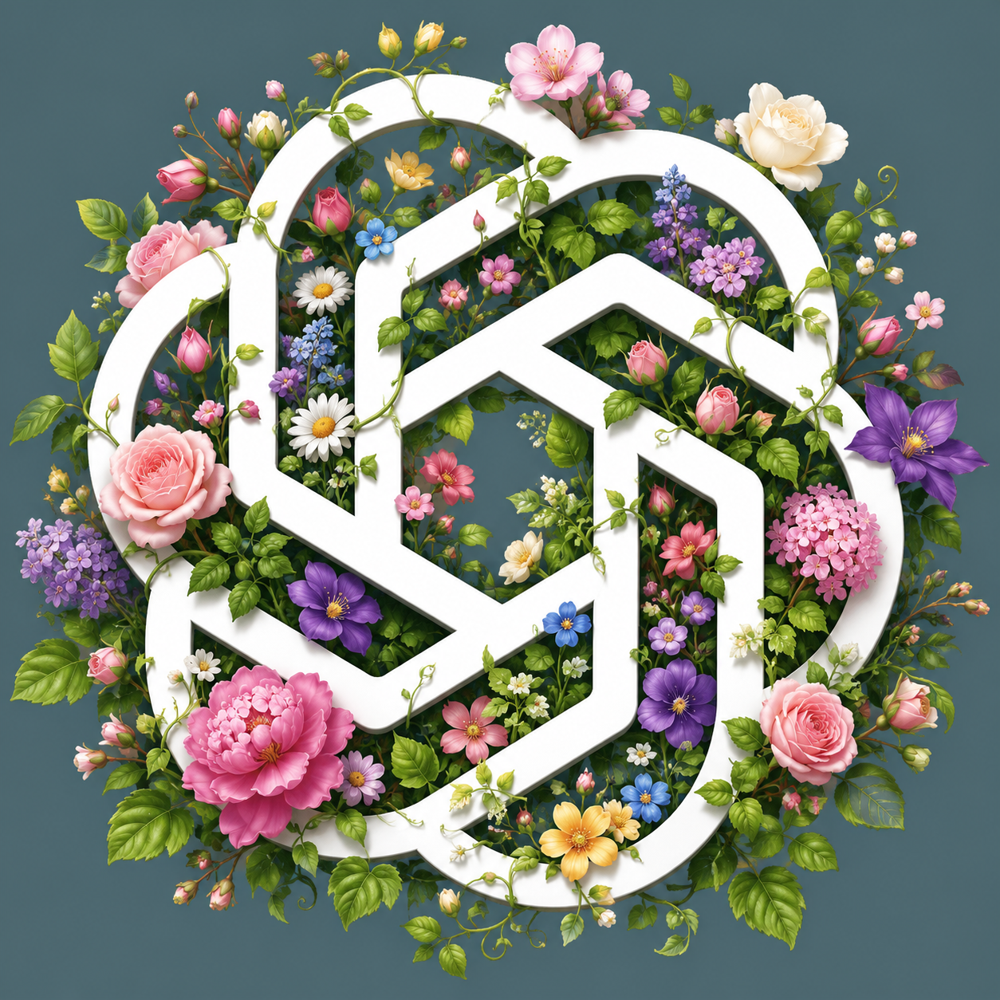
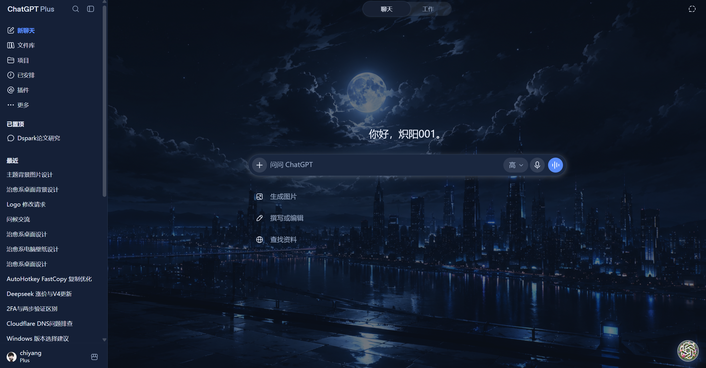
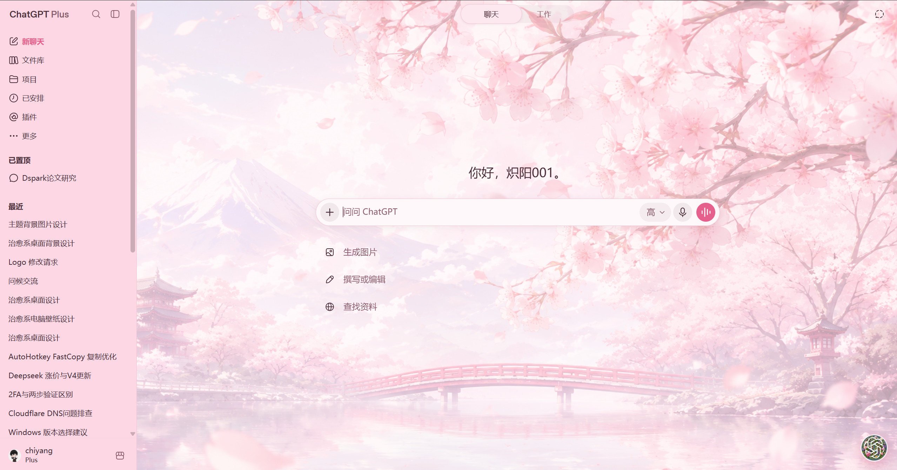
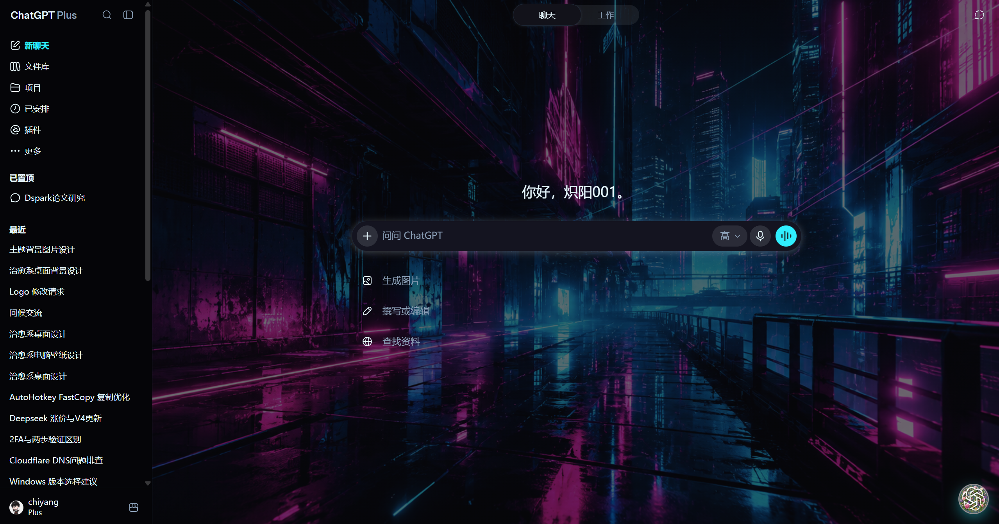
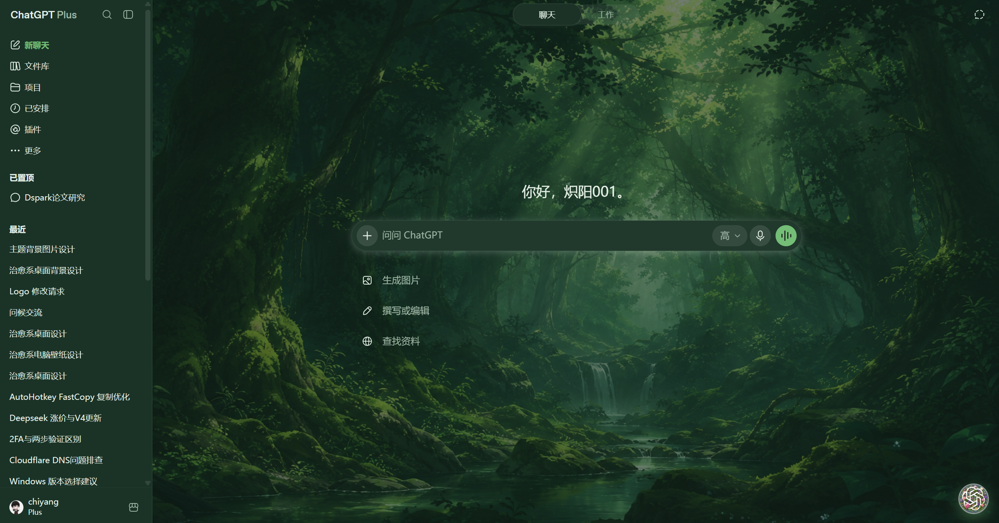
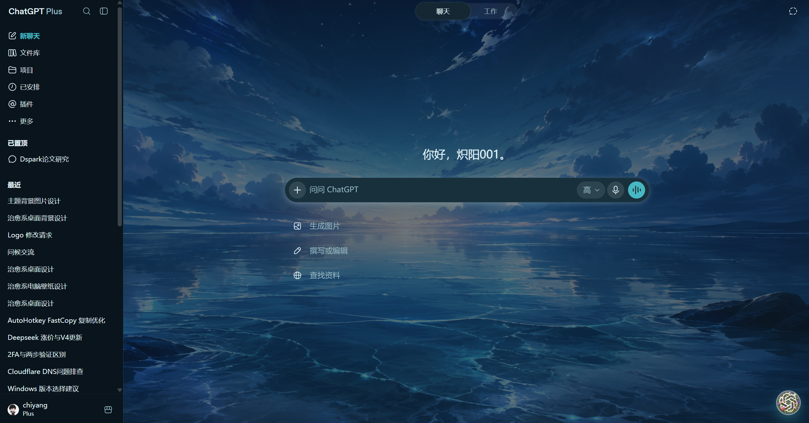
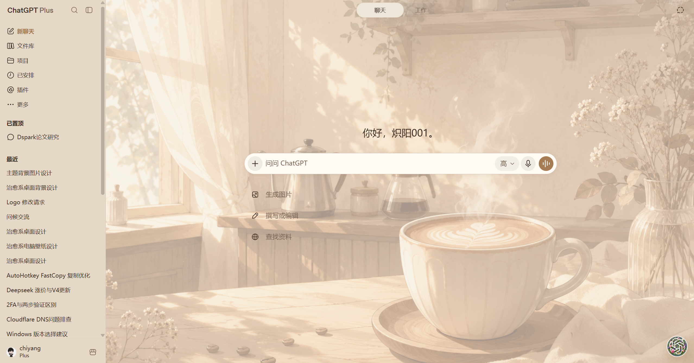
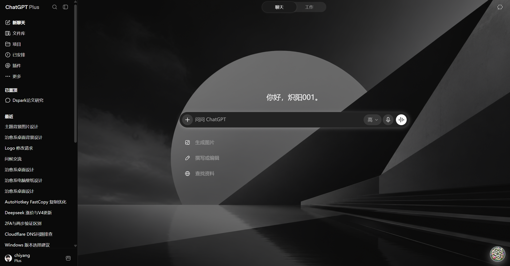
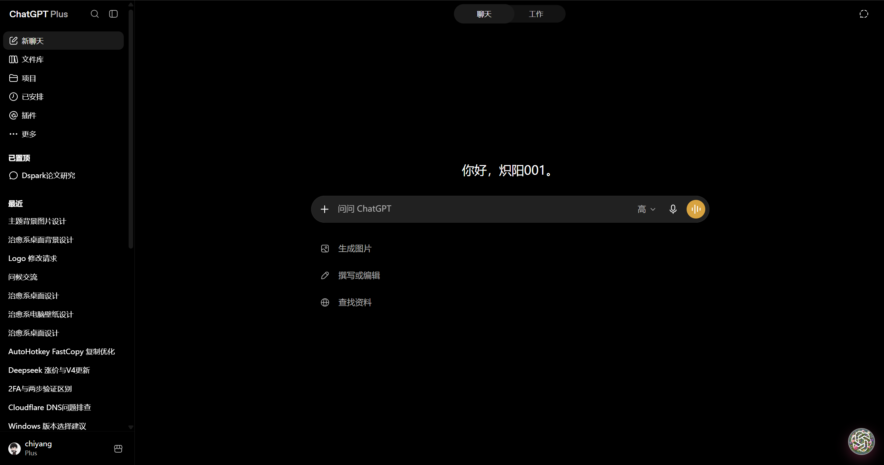

<p align="center">
  
  
  
</p>

<h1 align="center">Beauty-GPT</h1>

<p align="center">
  <b>为 ChatGPT 网页端打造的精美换肤扩展</b><br/>
  预设主题 · 自定义配色 · 图片 / 视频背景
</p>

<p align="center">
  <a href="https://space.bilibili.com/404891612"></a>
  &nbsp;
  <a href="https://github.com/Chiyang001?tab=repositories"></a>
  &nbsp;
  
</p>

---

## 简介

**Beauty-GPT** 是一款面向 [ChatGPT](https://chatgpt.com) 网页端的 Chrome 扩展。

在不影响正常对话的前提下，为界面换上更有氛围的主题与壁纸，也支持自定义图片 / 视频背景。  
由 UP 主 / 开发者 **炽阳001**（[Chiyang001](https://github.com/Chiyang001)）制作。

<p align="center">
  <code>Chrome MV3</code>
  &nbsp;·&nbsp;
  <code>chatgpt.com</code>
  &nbsp;·&nbsp;
  <code>本地持久化</code>
  &nbsp;·&nbsp;
  <code>Shadow DOM 面板</code>
</p>

---

## 效果预览

以下为不同主题与背景开启后的实际页面效果（截取自 ChatGPT 网页端）。

<table>
  <tr>
    <td align="center" width="50%">
      <br/>
      <sub><b>午夜</b> · 冷蓝夜景壁纸</sub>
    </td>
    <td align="center" width="50%">
      <br/>
      <sub><b>樱花</b> · 治愈系粉白风景</sub>
    </td>
  </tr>
  <tr>
    <td align="center" width="50%">
      <br/>
      <sub><b>赛博</b> · 霓虹都市夜景</sub>
    </td>
    <td align="center" width="50%">
      <br/>
      <sub><b>森林</b> · 深林氛围壁纸</sub>
    </td>
  </tr>
  <tr>
    <td align="center" width="50%">
      <br/>
      <sub><b>海洋</b> · 星空海岸壁纸</sub>
    </td>
    <td align="center" width="50%">
      <br/>
      <sub><b>拿铁</b> · 暖色咖啡时光</sub>
    </td>
  </tr>
  <tr>
    <td align="center" width="50%">
      <br/>
      <sub><b>极简</b> · 灰度艺术壁纸</sub>
    </td>
    <td align="center" width="50%">
      <br/>
      <sub><b>极简</b> · 纯黑沉浸模式</sub>
    </td>
  </tr>
</table>

<p align="center"><sub>也可在面板中关闭主题壁纸，或上传自定义图片 / 视频作为背景。</sub></p>

---

## 功能亮点

<table>
  <tr>
    <td width="50%" valign="top">
      <h3>预设主题</h3>
      <p>内置 8 套风格，一键切换：</p>
      <p>
        <code>默认</code>
        <code>午夜</code>
        <code>樱花</code>
        <code>赛博</code><br/>
        <code>森林</code>
        <code>海洋</code>
        <code>拿铁</code>
        <code>极简</code>
      </p>
    </td>
    <td width="50%" valign="top">
      <h3>自定义配色</h3>
      <p>主背景、侧栏、文字、强调色、输入框、用户气泡等均可调整。</p>
      <p><b>改色即预览，自动保存</b>，无需额外点击应用。</p>
    </td>
  </tr>
  <tr>
    <td width="50%" valign="top">
      <h3>聊天背景</h3>
      <p>主题配套壁纸，透明度可调。</p>
      <p>支持上传自定义 <b>图片</b> 或 <b>视频</b>（建议 mp4 / webm，≤40MB）。</p>
    </td>
    <td width="50%" valign="top">
      <h3>浮动面板</h3>
      <p>页面内可拖拽按钮，位置自动记住。</p>
      <p>Shadow DOM 隔离样式，不与 ChatGPT 原有主题互相干扰。</p>
    </td>
  </tr>
</table>

---

## 快速安装

| 步骤 | 操作 |
| :---: | --- |
| **1** | 打开 Chrome，进入 `chrome://extensions/` |
| **2** | 开启右上角 **开发者模式** |
| **3** | 点击 **加载已解压的扩展程序** |
| **4** | 选择本仓库根目录（需包含 `manifest.json`） |
| **5** | 打开 [chatgpt.com](https://chatgpt.com)，右下角出现 Beauty-GPT 按钮即可使用 |

> **开发提示**  
> 修改扩展代码后，请先在扩展管理页点击「重新加载」，再硬刷新 ChatGPT 页面。

---

## 使用指南

```text
浮动按钮 → 打开面板
   ├─ 预设主题     一键切换配色与配套背景
   ├─ 聊天背景     开关壁纸 / 调透明度 / 上传图片或视频
   ├─ 自定义配色   拖动色板，实时预览并自动保存
   └─ 拖拽按钮     长按移动位置，刷新后仍保留
```

扩展图标的弹窗仅作快捷入口；**真正的换肤操作在页面内面板完成**。

---

## 项目结构

```text
Beauty-GPT/
├── manifest.json                 # 扩展清单（MV3）
├── README.md
├── assets/
│   ├── logo.png                  # 个人 Logo
│   ├── v-divider.svg             # README Logo 分隔线
│   ├── bilibili-color.svg        # B站图标
│   ├── github.svg                # GitHub 图标
│   ├── badge-*.svg               # README 社交徽章
│   ├── examples/                 # 主题效果截图
│   └── themes/                   # 各主题壁纸
├── icons/
│   └── logo.png                  # 软件 Logo / 扩展图标
└── src/
    ├── background.js             # Service Worker（视频分片存储）
    ├── content.js                # 面板 UI 与交互
    ├── theme-engine.js           # 主题引擎与壁纸逻辑
    ├── themes.json               # 预设主题定义
    ├── bg-player.html / .js      # 视频背景播放辅助
    ├── styles/                   # 注入样式与面板样式
    └── popup/                    # 扩展弹窗
```

---

## 权限说明

| 权限 | 范围 | 用途 |
| --- | --- | --- |
| `storage` | 扩展本地 / 同步存储 | 保存主题、壁纸设置与按钮位置 |
| Host | `chatgpt.com` / `chat.openai.com` | 仅在 ChatGPT 网页注入换肤能力 |

本扩展**不会**请求其它无关站点权限。

---

## 作者与联系

<p align="center">
  <br/><br/>
  <b>炽阳001</b>（Chiyang001）
</p>

<p align="center">
  <a href="https://space.bilibili.com/404891612"></a>
  &nbsp;
  <a href="https://github.com/Chiyang001?tab=repositories"></a>
</p>

| | |
| --- | --- |
| QQ | `3083248889` |
| 邮箱 | [`3083248889@qq.com`](mailto:3083248889@qq.com) |

欢迎关注、Star，以及反馈使用中的问题与建议。

---

## 兼容性说明

ChatGPT 前端 DOM 会不定期变化。主题通过高优先级 CSS 变量与区域选择器覆盖实现。

若某次站点改版导致局部失效，可在：

```text
src/theme-engine.js  →  generateThemeCss()
```

中补充对应选择器。

---

## License

本项目仅供**学习与个人美化**使用。

请遵守 ChatGPT / OpenAI 服务条款，以及 Bilibili、GitHub 等平台相关规定。
